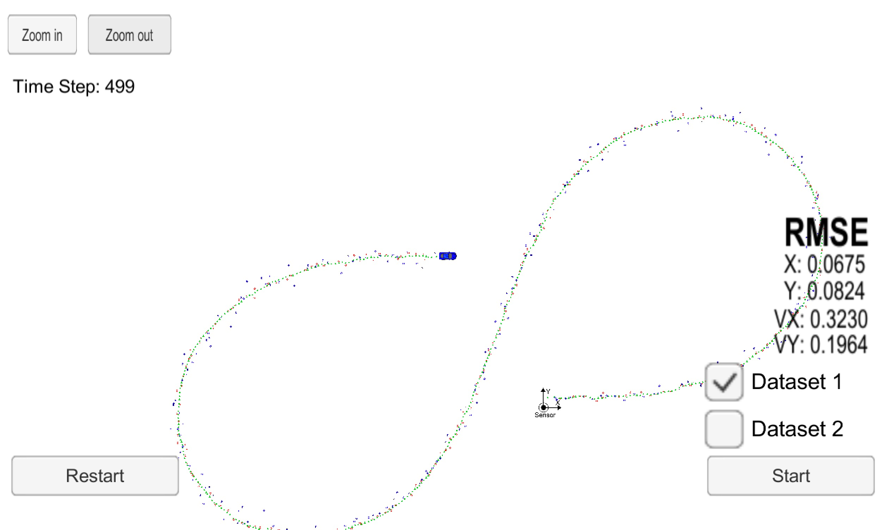

## Unscented Kalman Filter Project
---
Yangchun Luo

Jan 17, 2018

This is the assignment for Udacity's Self-Driving Car Term 2 Project 2.

---

The goal of this project is to utilize an Unscented Kalman Filter to estimate the state of a moving object of interest with noisy lidar and radar measurements. Passing the project requires obtaining RMSE values that are lower that the tolerance outlined in the project rubric.

### To build

```bash
mkdir build
cd build
cmake ..
make
./UnscentedKF
```

### To run

Download the [Term 2 simulator suite](https://github.com/udacity/self-driving-car-sim/releases). Open it and choose the EKF/UKF project.

Other setup information can be found in the original [README](README-orig.md) file.

### Parameters tuning

I calculated the NIS score for each processing iteration. I then summarized all the NIS scores by the percentage that is above the 95% threshold from Chi-Squared Distribution table (one summary per sensor type). I used such percentage to guide the tuning of linear and yaw acceleration noise parameters.  

If the percentage is above 5%, it means that I may have underestimated the acceleration noises. So I increase the parameter values. If the percentage is below 5%, it means that I may have overestimated the accleration noises. So I decrease the parameter values.

The following results are achieved using `std_a=1.5 m/s^2` and `std_yawa=1 rad/s^2`.

I aslo set the initial values of covariance matrix P differently for laser and radar measurements. Since laser measurement is more acurate, the corresponding entries for px and py are lower compared to if the first measurement is radar. This leads to further improvement for dataset 1 (where first measurement is laser).

### Performance evaluation

<table>
<tr><th><th>Px RMSE<th>Py RMSE<th>Vx RMSE<th>Vy RMSE
<tr><td>EKF-Dataset1<td>0.0973<td>0.0855<td>0.4513<td>0.4399
<tr><td><b>UKF-Dataset1<td><b>0.0675<td><b>0.0824<td><b>0.3230<td><b>0.1964
<tr><td>Improvement<td>30.6%<td>6.9%<td>28.4%<td>55.4%
<tr><td>EKF-Dataset2<td>0.0723<td>0.0969<td>0.4137<td>0.5277
<tr><td><b>UKF-Dataset2<td><b>0.0667<td><b>0.0683<td><b>0.3674<td><b>0.2041
<tr><td>Improvement<td>7.7%<td>29.5%<td>11.2%<td>61.3%
</table>

#### Dataset1


#### Dataset2


### Unit tests

For each calculation step in UKF, I added a unit test to ensure its numerical correctness. This has proven critical in the success of this project. It is much better and less hair-pulling to debug indivdual calculation step than having everything together and trying to figure which part is the culprit.  
